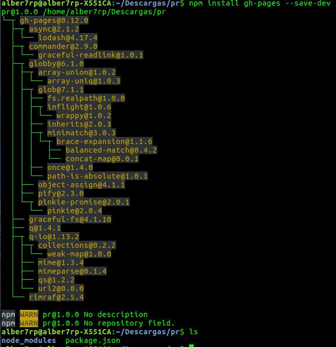
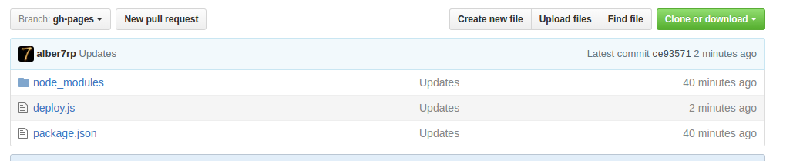

# Gh-pages

<div style="text-align:center"></div>


### ¿Qué es gh-pages?
Las gh-pages o Github pages son páginas web que Github pone a nuestra disposición para nuestros proyectos, con la particularidad de que estas deben de estar alojadas en los repositorios propios de Github. Con el simple gesto de actualizar nuestro repositorio, también estaremos haciendo lo propio con la gh-page.

### Creación de una gh-page
Suponiendo que tenemos un código correspondiente a una página web, para incluirlo en una gh-page se puede hacer de varias maneras:

* **Mediante Interfaz Gráfica**:
Github proporciona por cada repositorio una opción en la que indicamos la activación de una gh-page y hacia que rama queremos que apunte.

<div style="text-align:center"></div>

* **Mediante la creación directa de una rama gh-pages**:
Otra manera de publicar directamente una gh-page es crear una rama llamada **gh-pages** en la que alojemos ahí nuestro código de la página web.

<div style="text-align:center"></div>

  Creación de la rama *gh-pages* en el repo local, donde colocaremos todos los archivos perteneciente a la website que queremos alojar:

  ```
  git branch gh-pages
  ```

  Nos posicionamos localmente en la rama gh-pages creada, y subimos ahora directamente todos los archivos de esa rama, a la rama gh-pages del repo remoto, si no está creada, la crea automáticamente:

  ```
  git push origin gh-pages
  ```


### Módulo gh-pages despliegue automático
Este script de Node.js usa el módulo gh-pages como interfaz para interactuar con el repositorio.
Previamente se debe instalar dicho módulo para ser utilizable.

```
npm install gh-pages --save-dev
```

Su uso básico es el siguiente:

```
var ghpages = require('gh-pages');
var path = require('path');

ghpages.publish(path.join(__dirname, 'dist'), function(err) { ... });
```

>Calling this function will create a temporary clone of the current repository, create a gh-pages branch if one doesn't already exist, copy over all files from the base path, or only those that match patterns from the optional src configuration, commit all changes, and push to the origin remote.

>If a gh-pages branch already exists, it will be updated with all commits from the remote before adding any commits from the provided src files.

Básicamente tras la ejecución de este script se realizará un despliegue de gh-pages en el repositorio que le indiquemos a la funcion **publish()**, si dicha rama **gh-pages** no existe, la creará de forma automática.

Veamos un ejemplo real:

* **Paso 1**: Iniciamos el proyecto creando el fichero *package.json* que describirá y mantendrá nuestra aplicación:
```
npm init
```

* **Paso 2**: Instalamos el modulo de gh-pages para incluirlo en nuestro proyecto:
```
npm install gh-pages --save-dev
```

<div style="text-align:center"></div>

* **Paso 3**: Creamos un fichero *js*, por ejemplo *deploy.js*, en el que introduciremos el código que incluirá llamadas al módulo de gh-pages para hacer la subida a github de forma automática:

```
var ghpages = require('gh-pages');
var path = require('path');

ghpages.publish(path.join(__dirname, '.'),{
repo: 'https://github.com/alu0100825510/prueba.git'}, function(err) {
console.log(err);
console.log("Se ha subido a gh-pages correctamente");
});
```
<div style="text-align:center"></div>

Tras la ejecución de éste último paso, podemos ver en nuestro repositorio remoto de github que se han subido correctamente los archivos a la rama *gh-pages*:

<div style="text-align:center"></div>
