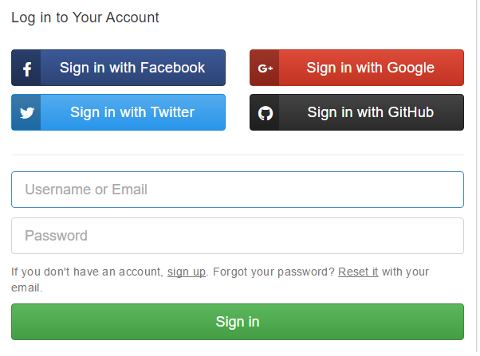

# Gitbook

### ¿Qué es Gitbook?
Gitbook es una plataforma que permite al usuario publicar la documentación de su proyecto utilizando diferentes plantillas . Las plantillas que posee Gitbook para crear una documentación son:
* Documentación tipo Libro.
* Documentación de una API.
* Base de conocimientos.

Gitbook está disponible mediante dos soportes, además de gitbook online,también está disponible [Gitbook Editor](https://www.gitbook.com/editor), que es una herramienta de creación de libros de manera local.

### Inicio de sesión en Gitbook
Para el inicio de sesión de manera online es necesario que se tenga previamente una cuenta en alguno de éstos soportes: **Twitter**, **Facebook**, **Google+** o **Github**.

En mi caso es recomendable el inicio de sesión mediante Github, ya que su sincronización directa con los repositorios puede dar lugar a una mayor facilidad de uso y ventajas.

### Creación de un libro en Gitbook
Cuando se inicia sesión por primera vez, aparecerá la siguiente imagen con la que se puede escoger que tipo de libro queremos crear.

Existen varias maneras de crear e introducir contenido en un libro gitbook:

* Mediante **importación de archivos** (pdf, epub, html, etc).

* Mediante **sincronización de repositorio con Github**.

En gitbook, al igual que en github también consta de ramas y confirmaciones. Esta información está disponible en el apartado **update** del libro en cuestión, a continuación se puede ver un ejemplo de ello.

