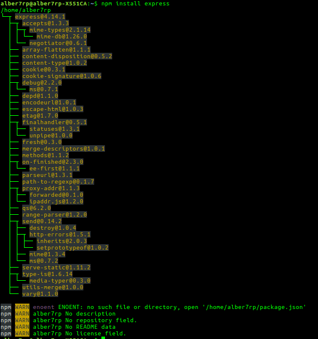
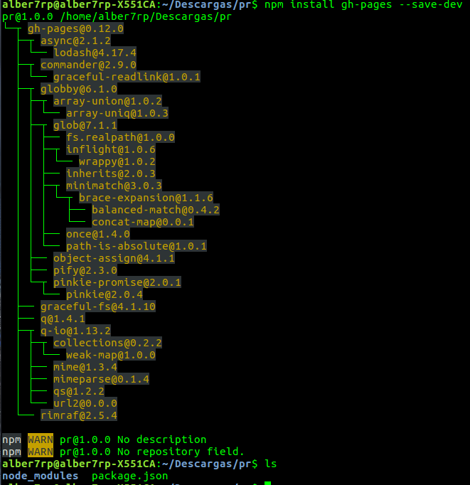
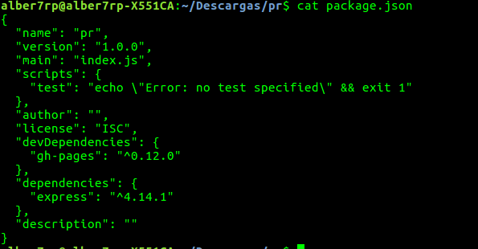
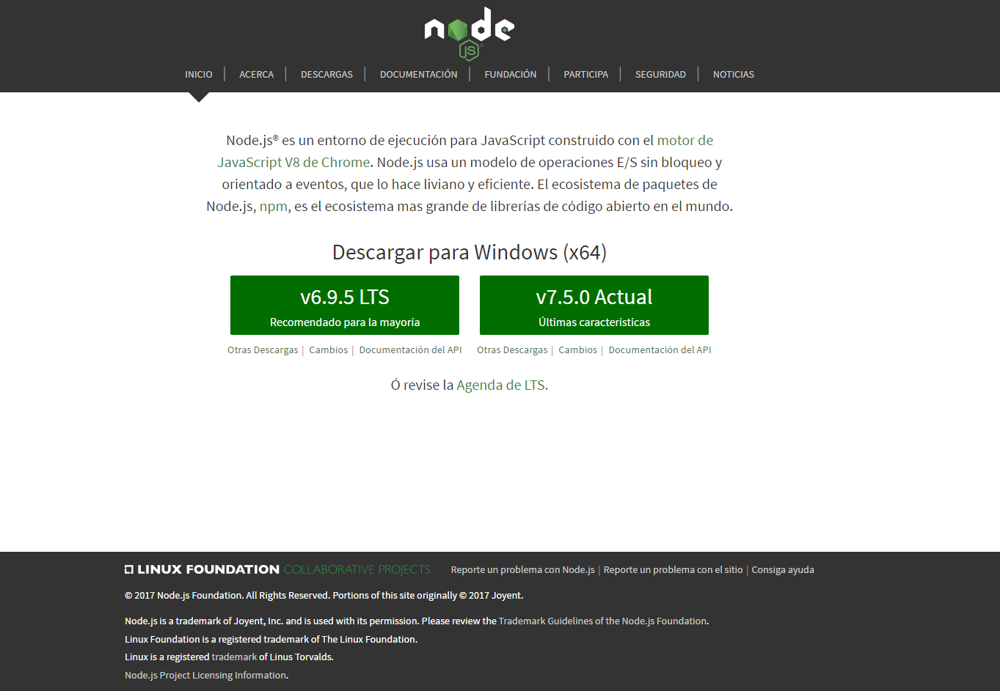

# Node JS

<div style="text-align:center"></div>


### ¿Qué es nodejs?
Node es un intérprete Javascript del lado del servidor que cambia la noción de cómo debería trabajar un servidor. Su meta es permitir a un programador construir aplicaciones altamente escalables y escribir código que maneje decenas de miles de conexiones simultáneas en una sólo una máquina física.

### Instalación
Para la instalación dependerá del sistema en el que queramos que se realice la instalación, en primer lugar mostraremos los procedimientos para sistemas **Ubuntu**, seguido de los necesarios para los sistemas **Windows**.

#### Instalación nodejs Ubuntu
En este caso al estar bajo una distribución de Ubuntu, éste nos proporciona un repositorio de paquetes que son de fácil instalación mediante un único comando:

```
$ sudo apt-get install nodejs
```

Tras la ejecución del anterior comando, nodejs se habrá instalado correctamente.

```
$ node
> 4+4
8
>
```

A su vez también es conveniente la instalación del gestor de paquete oficial de nodejs, **npm**, con el que se podrán instalar dependencias.

```
$ sudo apt-get install npm
```
Para demostrar su correcta instalación, realizaremos por medio de npm le descarga e instalación del paquete **express** de nodejs.
```
npm install express
```
<div style="text-align:center"></div>

Otro ejemplo que podemos ver también es la instalación del módulo **gh-pages**, el cual se explicará su funcionamiento en el capitulo de gh-pages.
```
npm install gh-pages --save-dev
```
<div style="text-align:center"></div>

Por último, y como dato importante sobre npm, describimos la utilización de npm para desarrollar un supuesto proyecto.
```
npm init
```
Dicho comando inicializa por decirlo de alguna manera la estructura de nodejs de nuestro proyecto, básicamente crea el fichero **package.json**, en el cual se especificarán aspectos referentes a la aplicación, como puede ser la versión, dependencias, descripción, autor, scripts, repositorio de git, motor de node etc.
Un ejemplo podría ser:

<div style="text-align:center"></div>


#### Instalación nodejs Windows
En este caso, para su instalación será necesario visitar la página web oficial de nodejs ([Aquí](https://nodejs.org/es/)), y descargar y posteriormente instalar la versión que deseamos.
<div style="text-align:center"></div>
