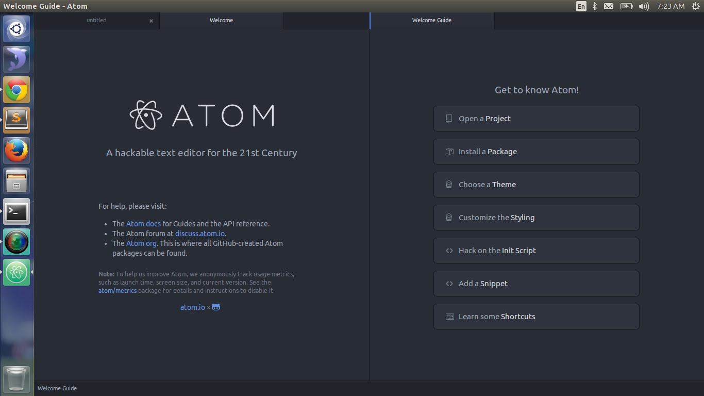
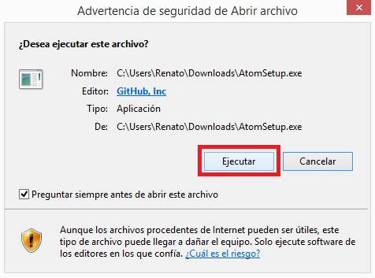

# Atom

<div style="text-align:center"></div>

### ¿Qué es Atom?
Atom es un editor de código de fuente abierta para macOS, Linux, y Windows con soporte para plug-ins escrito en Node.js, Incrustando Git Control, desarrollado por GitHub. Es una aplicacion de escritorio construida utilizando tecnologias web. Está basado en Electrón (Anteriormente conocido como Atom Shell),Un framework que permite aplicaciones de escritorio multiplataforma usando Chromium y Node.js. También puede ser utilizado como un entorno de desarrollo integrado (IDE), Atom libero su beta en la versión 1.0,  Sus desarrolladores lo llaman un "Editor de textos hackable para el siglo XXI".
<div style="text-align:center"></div>

### Instalar Atom en Linux
Atom es el editor de texto "hackeable" de GitHub, totalmente basado en tecnologías web.
Para poder instalarlo comenzamos con las dependencias básicas:

```
sudo apt-get update
sudo apt-get upgrade
sudo apt-get install build-essential git libgnome-keyring-dev fakeroot
```

También instalaremos node.js ya que Atom depende de este entorno de programación en javascript:

```
curl -sL https://deb.nodesource.com/setup | sudo bash -
sudo apt-get install -y nodejs
```

Para saber la versión de Node.js:
```
node -v
```

Node.js instalará npm automáticamente, para configurarlo:

```
npm config set python /usr/bin/python2 -g
```

Para instalar Atom abrimos un terminal y clonamos el código de Git:
```
git clone https://github.com/atom/atom
```

Cambiamos al directorio de Atom:

```
  cd atom  
 git fetch -p  
 git checkout $(git describe --tags `git rev-list --tags --max-count=1`)
```

Construimos Atom:
```
script/build
```

Ahora ya podemos ejecutar Atom. Otra opción es crear un archivo ejecutable .deb, lo hacemos con el siguiente comando:
```
script/grunt mkdeb
```

### Instalar Atom en Windows

Podemos encontrar el instalador del editor Atom en el siguiente link:
[Atom](https://atom.io/)  
* Podrán encontrar un botón de descarga "Download Windows Installer".

<div style="text-align:center"></div> <br>

* Una vez que hayamos descargado el programa ejecutamos el instalador.

<div style="text-align:center"></div> <br>

El instalador tardará unos cuantos minutos para descargarse y tendremos listo el programa
