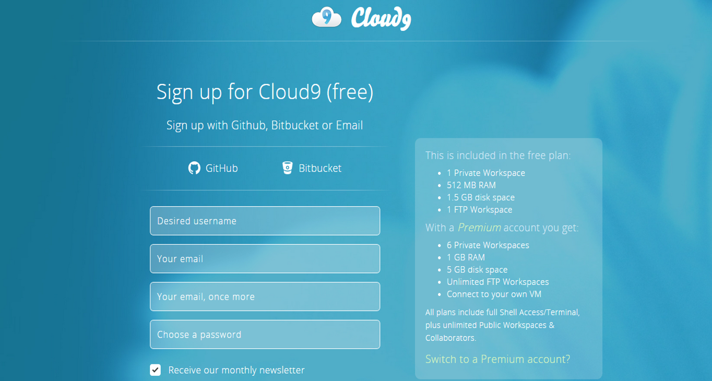
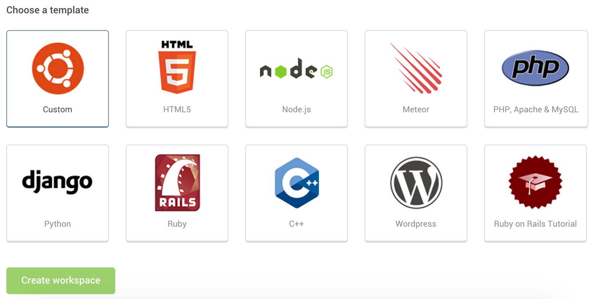
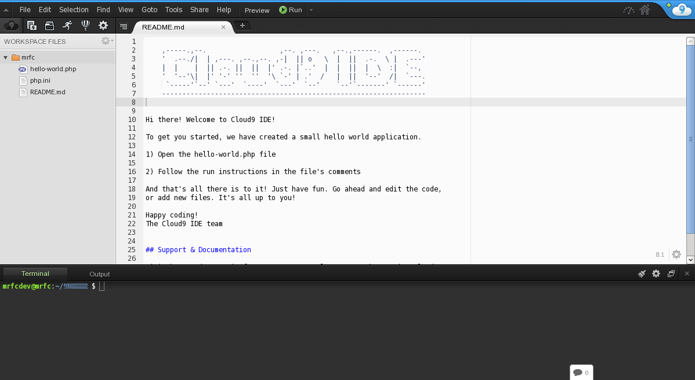

## ¿Qué es Cloud9?
**Cloud9** (c9) es un entorno de desarrollo online que nos permite no solo editar código,también administrar un servidor virtual. Básicamente lo que tienes aquí es un programa que se ejecuta sobre el navegador pero que a pesar de ese limitante tiene las funcionalidades más destacadas de un IDE en el que además tenemos un entorno de trabajo real donde podemos poner nuestros programas en ejecución, ya sean sitios web o programas ejecutables.

## Instalación y uso
Como es un servicio completamente online **no tendremos que instalar nada en nuestra máquina.**
Debemos seguir unos sencillos pasos a continuación:
* **Paso 1.** Dirígase al siguiente enlace: [http://c9.io](http://c9.io)


* **Paso 2.** Cree una cuenta (usando BitBucket, Github o una nueva cuenta de Cloud9) o inicie sesión si ya tiene una cuenta para ver su Panel de Control.



* **Paso 3.** Entre a su Dashboard.


* **Paso 4.** Una vez en nuestra dashboard deberemos crear un nuevo workspace. Este puede ser público o privado. Podremos predifinir una plantilla diferente según el lenguaje de programación que vayamos a utilizar si conocemos esta información como se muestra en las dos imagenes siguientes.




* **Paso 5.** Una vez creado el workspace podremos empezar a editarlo creando subcarpetas, archivos y teniendo a nuestra disposición una terminal como se muestra a continuación.



```
user_name:~/workspace $ 
```
