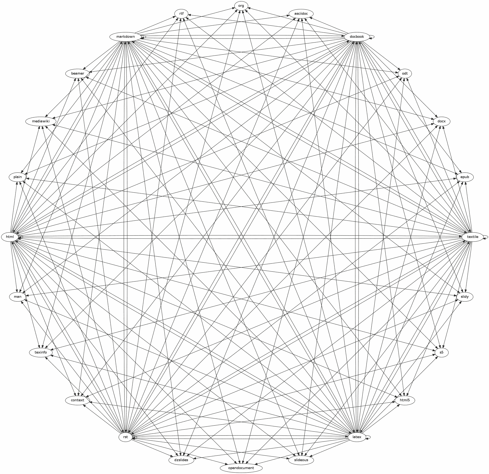

# Pandoc

### ¿Qué es Pandoc?
Si necesita convertir archivos de un formato de marcado a otro, pandoc es su herramienta perfecta. Pandoc puede convertir documentos en markdown, reStructuredText, textile, HTML, DocBook, LaTeX, MediaWiki markup, TWiki markup, OPML, Emacs Org-Mode, Txt2Tags, Microsoft Word docx, LibreOffice ODT, EPUB, o Haddock markup a:

* HTML formats: XHTML, HTML5, and HTML slide shows using Slidy, reveal.js, Slideous, S5, or DZSlides.
* Word processor formats: Microsoft Word docx, OpenOffice/LibreOffice ODT, OpenDocument XML
Ebooks: EPUB version 2 or 3, FictionBook2
* Documentation formats: DocBook, TEI Simple, GNU TexInfo, Groff man pages, Haddock markup
* Page layout formats: InDesign ICML
* Outline formats: OPML
* TeX formats: LaTeX, ConTeXt, LaTeX Beamer slides
* PDF via LaTeX
* Lightweight markup formats: Markdown (including CommonMark), reStructuredText, AsciiDoc, MediaWiki markup, DokuWiki markup, Emacs Org-Mode, Textile
* Custom formats: custom writers can be written in lua.
