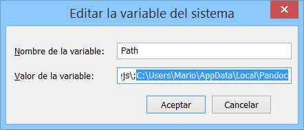

# Pandoc

<div style="text-align:center"></div>

### ¿Qué es Pandoc?
Si necesita convertir archivos de un formato de marcado a otro, pandoc es su herramienta perfecta. Pandoc puede convertir documentos en markdown, reStructuredText, textile, HTML, DocBook, LaTeX, MediaWiki markup, TWiki markup, OPML, Emacs Org-Mode, Txt2Tags, Microsoft Word docx, LibreOffice ODT, EPUB, o Haddock markup a:

* HTML formats: XHTML, HTML5, and HTML slide shows using Slidy, reveal.js, Slideous, S5, or DZSlides.
* Word processor formats: Microsoft Word docx, OpenOffice/LibreOffice ODT, OpenDocument XML
Ebooks: EPUB version 2 or 3, FictionBook2
* Documentation formats: DocBook, TEI Simple, GNU TexInfo, Groff man pages, Haddock markup
* Page layout formats: InDesign ICML
* Outline formats: OPML
* TeX formats: LaTeX, ConTeXt, LaTeX Beamer slides
* PDF via LaTeX
* Lightweight markup formats: Markdown (including CommonMark), reStructuredText, AsciiDoc, MediaWiki markup, DokuWiki markup, Emacs Org-Mode, Textile
* Custom formats: custom writers can be written in lua.

**Pandoc** entiende una seriede sintaxis de markdown muy útil, incluyendo metadatos del documento (título, autor, fecha); Notas a pie de página; mesas; Listas de definición; Superíndice y subíndice; Listas ordenadas mejoradas; Listas de ejemplos corrientes; Bloques de código delimitados con resaltado de sintaxis; Citas inteligentes, guiones y elipses; Markdown dentro de los bloques HTML; Y LaTeX en línea. Si se desea una compatibilidad de marcado estricta, todas estas extensiones se pueden desactivar.

<div style="text-align:center"></div>

### **Instalación de Pandoc en Windows**

* Paso 1. Descargar el programa desde [aquí](https://github.com/jgm/pandoc/releases/tag/1.19.2.1)

* Para la generacion de PDF recomendamos [Miktex](https://miktex.org/download)

<div style="text-align:center"></div> <br>

* Paso 2. Cuando esté Pandoc instalado, debemos añadirlo a las variables de entorno de Windows, ya que si no lo hacemos, Sublime Text no podrá ejecutar el comando. Para ello, vamos a la configuración avanzada del sistema:

<div style="text-align:center"></div> <br>

*  Paso 3. Se abrirá una ventana y tenéis que hacer click en "Variables de entorno":

<div style="text-align:center"></div> <br>

* Paso 4. Ahora tenéis que copiar como texto (click derecho, "copiar como texti") la ruta del directorio de instalación de Pandoc:

<div style="text-align:center"></div> <br>

* Paso 5. La dirección que habeis copiado la teneis que introducir en la variable **Path**

<div style="text-align:center"></div> <br>

Una vez llegueis a este punto, todo **listo**.

### **Instalación de Pandoc en Ubuntu**

Hay que introducir el siguiente comando por consola y ya estará todo listo. Tarda un poco, así que paciencia.

```
sudo apt-get install pandoc texlive
```
